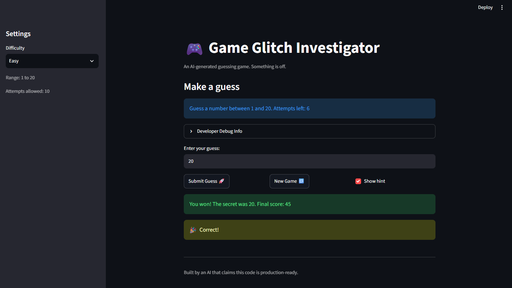

# 🎮 Game Glitch Investigator: The Impossible Guesser

## 🚨 The Situation

You asked an AI to build a simple "Number Guessing Game" using Streamlit.
It wrote the code, ran away, and now the game is unplayable. 

- You can't win.
- The hints lie to you.
- The secret number seems to have commitment issues.

## 🛠️ Setup

1. Install dependencies: `pip install -r requirements.txt`
2. Run the broken app: `python -m streamlit run app.py`

## 🕵️‍♂️ Your Mission

1. **Play the game.** Open the "Developer Debug Info" tab in the app to see the secret number. Try to win.
2. **Find the State Bug.** Why does the secret number change every time you click "Submit"? Ask ChatGPT: *"How do I keep a variable from resetting in Streamlit when I click a button?"*
3. **Fix the Logic.** The hints ("Higher/Lower") are wrong. Fix them.
4. **Refactor & Test.** - Move the logic into `logic_utils.py`.
   - Run `pytest` in your terminal.
   - Keep fixing until all tests pass!

## 📝 Document Your Experience

- [x] Describe the game's purpose.
  - The purpose of the game is to guess a correct number according to the range given by the selected difficulty. Hints are to be used to guess the correct number to win as quickly as possible to get the most amount of points.
- [x] Detail which bugs you found.
  1. Swapped hints: A too-high guess said "Go higher" and a too-low guess said "Go lower."
  2. String comparison on even attempts: The secret was cast to a string, so guesses were compared as text ("9" > "50") and gave wrong hints.
  3. Hint didn't return: Unchecking "Show hint" hid it, but re-checking never brought it back because it was only drawn inside if submit:.
  4. New Game didn't fully reset: The win/lose banner stayed, the game was blocked, and the score, history, and old guess text carried over.
  5. Wrong secret range on New Game: The secret always came from 1–100, even on Easy or Hard.
  6. Wrong range message: The prompt always said "between 1 and 100" regardless of difficulty.
  7. Attempts out of order: Easy allowed fewer attempts (6) than Normal (8).
  8. Ranges out of order: Hard (1–50) was smaller than Normal (1–100).
  9. Off-by-one attempts: Attempts started at 1 on the first game but 0 after New Game, which cost a guess and skewed the win score (70 instead of 90).
  10. Stale info and debug display: "Attempts left" and the debug info lagged one submission behind.
  11. Info and debug vanished after game over: st.stop() halted the script before they were drawn.
  12. Empty guess used an attempt: Submitting a blank or whitespace-only guess cost an attempt and was added to history.
- [x] Explain what fixes you applied.
    1. Swapped hints: Swapped the messages in check_guess so a too-high guess says "Go LOWER!" and a too-low guess says "Go HIGHER!"
   2. String comparison on even attempts: Removed the str() cast on the secret in app.py so check_guess always compares integers.
   3. Hint didn't return: Saved the hint in st.session_state.last_hint and render it outside if submit: whenever "Show hint" is checked.
   4. New Game didn't fully reset: New Game now sets status to "playing", resets score and history, and bumps game_id (part of the input key) to clear the guess box.
   5. Wrong secret range on New Game: New Game now uses random.randint(low, high) for the selected difficulty instead of a hardcoded 1–100.
   6. Wrong range message: The info message now uses {low} and {high} instead of the fixed "1 and 100."
   7. Attempts out of order: Set Easy to 10 attempts in attempt_limit_map, so Easy > Normal (8) > Hard (5).
   8. Ranges out of order: Changed get_range_for_difficulty so Normal is 1–50 and Hard is 1–100.
   9. Off-by-one attempts: attempts now starts at 0 on first load and in New Game, and the extra + 1 was removed from the win formula in update_score.
   10. Stale info and debug display: Reserved their spots with st.empty() and st.container() and fill them after the submit handler so they show the updated state.
    11. Info and debug vanished after game over: Removed st.stop() and changed the handler to if submit and status == "playing" so extra submits do nothing.
    12. Empty guess used an attempt: Added a check in app.py that rejects empty or whitespace-only input before attempts is incremented, and parse_guess now uses raw.strip().

## 📸 Demo Walkthrough

Describe your fixed game in numbered steps so a reader can follow along without watching a video:

1. User enters a guess of 25
2. Game returns "Go LOWER!"
3. User enters a guess of 15, and the game shows "Go HIGHER!"
4. User enters a guess of 20, and the game shows "Go LOWER!"
5. Score updates correctly after each guess
6. User enters a guess of 17, and the game shows "You won! The secret was 17. Final score: 45" and "🎉
Correct!"
7. Game ends after the correct guess

**Screenshot** *(optional)*: <!-- Insert a screenshot of your fixed, winning game here -->


## 🧪 Test Results

```
# Paste your pytest output here, e.g.:
# pytest tests/
# ========================= X passed in 0.XXs =========================
```
'''
tests\test_game_logic.py ...................................                                                                  [100%]
======================================================== 35 passed in 0.06s ========================================================
'''

## 🚀 Stretch Features

- [ ] [If you choose to complete Challenge 4, describe the Enhanced UI changes here — a screenshot is optional]
